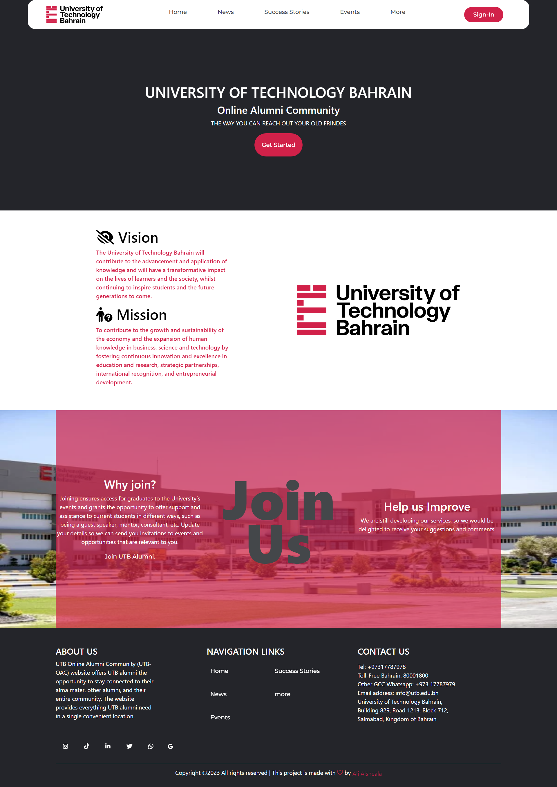

# Alumni Project README



This README provides important information about the Alumni project. It includes details about the technologies used, required applications, project structure, and instructions for setting up the project.

## Technologies

- HTML: Hyper Text Markup Language
- CSS: Cascading Style Sheets
- JS: JavaScript
- PHP: Hypertext Preprocessor
- MVC: Model-View-Controller

## Required Applications

To run the Alumni project, you need the following applications:

- Xampp: A software package that contains Apache, MySQL, and PHP, allowing you to run a local development environment.
- VScode: A source code editor that provides a great development experience.

## Project Structure

- Front-End: HTML, CSS, JS
- Back-End: PHP, SQL
- Extra: Bootstrap, Composer, dcblogdev/pdo-wrapper

For the admin section, the AdminLTE-3.0.5 template was used.

## Setting Up the Project

To set up the project, follow these steps:

1. Open the file `C:/xammp/apache/conf/extra/httpd-vhosts.conf`.
2. Paste the following text into the file:

```apacheconf
<VirtualHost *:80>
    DocumentRoot "C:\xampp\htdocs\Workss\Alumni\public"
    ServerName Alumni.test
</VirtualHost>
```

3. Run a text editor or Notepad as an administrator.
4. Open the file `C:/Windows/System32/drivers/etc/hosts`.
5. Paste the following text into the file:

```
127.0.0.1       Alumni.test
```

## Accessing the Project

To access the different parts of the Alumni project, use the following URLs:

- Index Page: [http://alumni.test/](http://alumni.test/)
- Admin Page: [http://alumni.test/adminpost/login](http://alumni.test/adminpost/login)
- Database: [http://localhost/phpmyadmin/index.php?route=/database/structure&db=fs8_proone](http://localhost/phpmyadmin/index.php?route=/database/structure&db=fs8_proone)

Make sure that your Xampp environment is running before accessing the URLs.

## Conclusion

This README provides an overview of the Alumni project, including the technologies used, required applications, project structure, and setup instructions. Use the provided URLs to access different sections of the project.